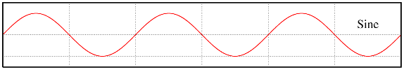
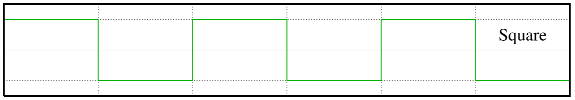
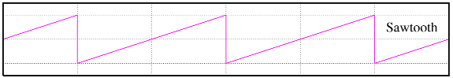
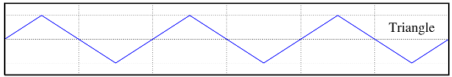

## Web Audio API Series 2 - Oscillator

In this *Web Audio API Series*, we will introduce how to process and synthesize sound in the web browser, which will cover over 80% features of Web Audio API, as well as some basic general knowledge about music theory, audio, sound, and signal processing:

- Introduction
- Synthesis Basics
    - 4 Different Sound Units
    - Timing and Rhythm
    - Basic Scales and Chord
    - Envelope
    - Filters
- Audio 
    - Decode and Playback
    - Samples
    - Draw Waveforms for Time Domain
    - Draw Spectrum for Frequency Domain
- Audio Effect
    - Tremolo
    - Overdrive/Distortion
    - EQ
    - Delay
    - Reverb

---

## What is Oscillator

An oscillator is a circuit that produces a repetitive, oscillating signal. Along with audio filters and audio controllers, audio oscillators are one of the basic elements required for modern analog subtractive synthesizers.

There are basic two parameters for an oscillator: type and frequency. Type defines the tone of the sound while the frequency means the pitch of the sound. Suppose that you are playing the middle C note on both a guitar and a piano, those two sounds have different type but the same frequency.

## Four Waveform Types of Oscillator

* Sine



[440Hz sine wave audio](https://soundcloud.com/haochuan/sine/s-6bb9b?in=haochuan/sets/web-audio-series-osc/s-PgUGl)

* Square



[440Hz square wave audio](https://soundcloud.com/haochuan/square/s-FtUUN?in=haochuan/sets/web-audio-series-osc/s-PgUGl)

* Sawtooth



[440Hz sawtooth wave audio](https://soundcloud.com/haochuan/sawtooth/s-mT39a?in=haochuan/sets/web-audio-series-osc/s-PgUGl)

* Triangle



[440Hz triangle wave audio](https://soundcloud.com/haochuan/triangle/s-OTq6H?in=haochuan/sets/web-audio-series-osc/s-PgUGl)

## Oscillator in Web Audio API

The Web Audio API allows us to generate oscillating wave forms quite easily: The `OscillatorNode` interface represents a periodic waveform.

#### Create Oscillator Node
- audioContext.createOscillator()

Note that the `audioContext` should be created as global variable when initializing the Web Audio API.

#### Properties
- OscillatorNode.frequency
- OscillatorNode.type

#### Methods
- OscillatorNode.start()
- OscillatorNode.stop()

Note that I jsut listed some of the properties and methods we will use in this tutorial. You can find more details in [Web Audio API doc](http://webaudio.github.io/web-audio-api/).

## Demo
We talked about the `Audio Node` connections in *Web Audio API Series 1*. For this oscillator demo, the connection will be like this:

Oscillator Audio Node --->  audioContext.destination (system output)

And there is also one more thing to metion that when we are trying to change the frequency in an oscillator audio node, we cannot just do `OscillatorNode.frequency = 100`. The reason is that`frequency` is an `AudioParam` instead of a `number`. The way to set a new frequency value is using `OscillatorNode.frequency.value = 100`.

```js
// init web audio api

var audioContext;
try {
    // Fix up for prefixing
    window.AudioContext = window.AudioContext||window.webkitAudioContext;
    audioContext = new AudioContext();
} catch(e) {
    alert('Web Audio API is not supported in this browser');
}

// create a oscillator audio node
var oscNode = audioContext.createOscillator();
oscNode.type = 'sine'; // sine, square, sawtooth, triangle

// set a value in an AudioParam
oscNode.frequency.value = 440;

// be sure to connect the osc node to destination before starting it

oscNode.connect(audioContext.destination);

oscNode.start(0); // start now

oscNode.stop(2); // stop in 2 seconds
```

You can view the live demo here: [haochuan's codepen](http://codepen.io/haochuan/full/PZaEXo/)

---

That's all. If you want to know more details, please search for `Web Audio API` in your favorite search engine. Hope you enjoy and see you in next coming article for my Web Audio API Series.