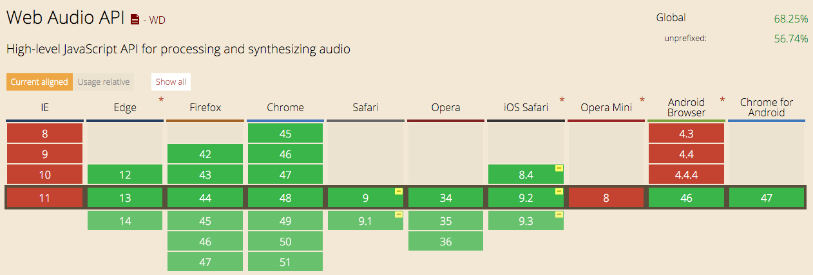

## Web Audio API 系列教程 1 - 介绍

在本*Web Audio API 系列教程*中， 我们将会介绍与实践怎样在浏览器里处理以及合成声音，过程中涉及到Web Audio API中80%以上的功能，同时会涵盖一些相关的基础乐理，声音，以及信号处理等知识。

- 介绍
- 合成器基础
    - 4种基本声音波形
    - 时间和节奏
    - 音节和和弦
    - 包络
    - 滤波器
- 声音
    - 解码和回放
    - 采样
    - 绘制时间域下的波形图
    - 绘制频率域下的波谱图
- 声音效果
    - 颤音
    - 过载失真
    - 均衡
    - 延迟
    - 混响

---

## 什么是 Web Audio API

Web Audio API是浏览器里面的一个用来处理和合成声音的Javascript接口。这个API是被设计用来编写游戏声音引擎，以及来完成我们在各种音乐制作软件中对声音的编辑和混缩。你可以在Web Audio API的[官方文档](http://webaudio.github.io/web-audio-api/)里获得详细的信息。

## Web Audio API和HTML5 Audio Tag的区别

HTML5的`audio`提供给开发人员一种对声音文件进行基本的读取，播放，暂停的功能， 同时还可以对声音文件的音量大小进行调整。但是Web Audio API是用于在浏览器里进行更为复杂的声音处理以及合成。设想作为一个摇滚吉他手，一些能够让你吉他的声音变得*摇滚*的效果器(过载，延迟，混响)是必不可少的。使用Web Audio API就可以在浏览器里来编写这些效果器来美化各种各样的声音。

- 例子: [干净的电吉他](https://soundcloud.com/haochuan/guitar1?in=haochuan/sets/test-1/s-pqdGV)
- 例子: [干净的电吉他 + 混响效果](https://soundcloud.com/haochuan/reverb?in=haochuan/sets/test-1/s-pqdGV)
- 例子: [干净的电吉他 + 贝斯合成器效果](https://soundcloud.com/haochuan/bass-synth?in=haochuan/sets/test-1/s-pqdGV)

相信看到这里你已经大概明白Web Audio API是用来做什么的了。假设我们现在硬盘里存有例子1中的声音文件，我们可以使用Web Audio API来用Javascript在浏览器写自己的声音效果来得到类似于例子2，3中的声音。

## 现在哪里可以使用Web Audio API

目前基本所有的主流浏览器的电脑版本和手机版本都支持Web Audio API。



## AudioContext

从这里开始我们正式进入Web Audio API.

`AudioContext`是浏览器里对声音各种各样处理和合成发生的地方。通过`AudioContext`我们就能够调用Web Audio API中的各种功能。下面是如何在浏览器里初始化这个`AudioContext`变量。

```js
var audioContext;

try {
    // Fix up for prefixing
    window.AudioContext = window.AudioContext||window.webkitAudioContext;
    audioContext = new AudioContext();
} catch(e) {
    alert('Web Audio API is not supported in this browser');
}
```

## Audio Node

让我们重新回到之前那个吉他的例子。当我们想让我们的吉他声拥有多种声音效果的时候，我们先把连着吉他的另一根线连在第一个效果器上，然后再把第一个效果器跟第二个效果器连起来，最后把第二个效果器跟音箱连起来。这样就通过串联来得到了两个声音效果。在Web Audio API中，我们也用同样的道理。每一个组件都是一个`Audio Node`，声音从第一个`Audio Node`流过第二个，第三个...直到最后一个`Audio Node`（通常是电脑的扬声器输出），以串联或者并联的方式来进行信号传输。下面是一个简单的例子。


```js
var node1 = audioContext.someFunction() // create first node (input)
var node2 = audioContext.someFunction(); // create second node
var node3 = audioContext.someFunction(); // create another node
node1.connect(node2);
node1.connect(node3);
node2.connect(audioContext.destination); // audioContext.destination is the system output
node3.connect(audioContext.destination); //
/*
node1 ----- node 2
  |           |
  |           |
  |           |          
node3 ----- destination
 */
```

---

这就此章节的全部内容。如果您想要获取更多Web Audio API的信息请自行搜索。希望您看的愉快，并且关注*Web Audio API 系列教程*即将到来的下期内容。   

