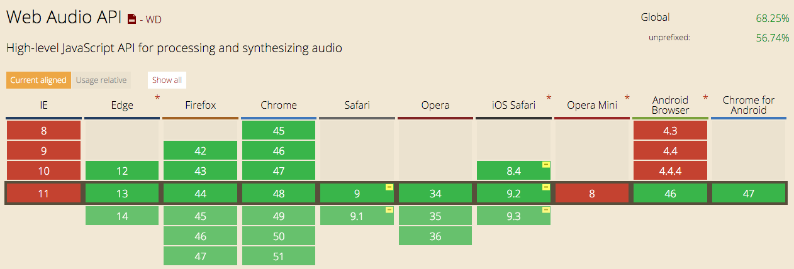

## Web Audio API Series 1 - Introduction

In this *Web Audio API Series*, we will introduce how to process and synthesise sound in the web browser, which will cover over 80% features of Web Audio API, as well as some basic general knowledge about music theory, audio, sound, and signal processing:

- Introduction
- Synthesis Basics
    - 4 Different Sound Units
    - Timing and Rhythm
    - Basic Scales and Chord
    - Envelope
    - Filters
- Audio 
    - Decode and Playback
    - Samples
    - Draw Waveforms for Time Domain
    - Draw Dpectrum for Frequency Domain
- Audio Effect
    - Tremolo
    - Overdrive/Distortion
    - EQ
    - Delay
    - Reverb

---

## What is Web Audio API

The Web Audio API is a high-level JavaScript API for processing and synthesizing audio in web applications. The goal of this API is to include capabilities found in modern game audio engines and some of the mixing, processing, and filtering tasks that are found in modern desktop audio production applications. What follows is a gentle introduction to using this powerful API. You can find more details in the [Web Audio API doc](http://webaudio.github.io/web-audio-api/)

## Difference Between Web Audio API and HTML5 Audio Tag

HTML5 `audio` tag gives developers a way to handle the basic audio playback functionalities (load, play, pause, stop), along with the audio volume controller. However, Web Audio API is used for processing and synthesizeing audio in the web browser. Suppose that you are a guitar player, you probably may need some guitar effect pedals (overdrive, delay, reverb) to get the rocky sound you like, it is exactly the role of Web Auiod API in the browser.

- Example: [pure electronic guitar sound](https://soundcloud.com/haochuan/guitar1?in=haochuan/sets/test-1/s-pqdGV)
- Example: [electronic guitar sound with reverb effect](https://soundcloud.com/haochuan/reverb?in=haochuan/sets/test-1/s-pqdGV)
- Example: [electronic guitar sound with bass synth effect](https://soundcloud.com/haochuan/bass-synth?in=haochuan/sets/test-1/s-pqdGV)

I think you can get the general idea from the examples. Using Web Audio API, if we have a file of first example, we can write our own audio effect code to generater the sounds in example 2 and 3.


## Where Can We use Web Audio API currently

Currently all of the modern browsers support Web Audip API including Chrome, FireFox and Safari in both desktop version and mobile version. 



## AudioContext

`AudioContext` is where all magic audio things happen in the browser. It is a little container where all our sound will live. It provides access to the Web Audio API, which in turn gives us access to some very powerful functions. Below is the Javascript code to initialize the global `AudioContext` variable in your browser.

```js
var audioContext;

try {
    // Fix up for prefixing
    window.AudioContext = window.AudioContext||window.webkitAudioContext;
    audioContext = new AudioContext();
} catch(e) {
    alert('Web Audio API is not supported in this browser');
}
```

## Audio Node

Let’s still get the example of a guitar player again. When the play wants to play his guitar, he takes a lead from his guitar and connects it to an effect pedal like a distortion pedal. He then connects another lead from his distortion pedal to either another effect or to his amplifier. This allows sound to travel from his guitar, get manipulated, and then be outputted to a speaker so people can hear his rock riffs. This is exactly how the Web Audio API works. Sound is passed around from one node to the next, being manipulated as it goes, before being finally outputted to your speakers. Here is a basic example.

```js
var node1 = audioContext.someFunction() // create first node (input)
var node2 = audioContext.someFunction(); // create second node
var node3 = audioContext.someFunction(); // create another node
node1.connect(node2);
node1.connect(node3);
node2.connect(audioContext.destination); // audioContext.destination is the system output
node3.connect(audioContext.destination); //
/*
node1 ----- node 2
  |           |
  |           |
  |           |          
node3 ----- destination
 */
```

---

That's all. If you want to know more details, please search for `web audio api` in your favarite search engine. Hope you enjoy and see you in next coming article for my Web Audio API Series.


