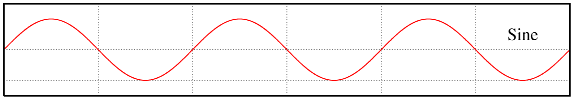
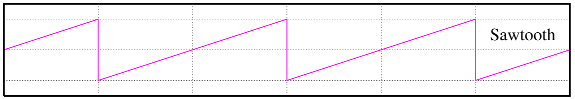
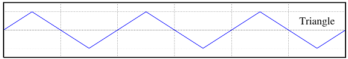

## Web Audio API 系列教程 2 - 振荡器

在本*Web Audio API 系列教程*中， 我们将会介绍与实践怎样在浏览器里处理以及合成声音，过程中涉及到Web Audio API中80%以上的功能，同时会涵盖一些相关的基础乐理，声音，以及信号处理等知识。

- 介绍
- 合成器基础
    - 4种基本声音波形
    - 时间和节奏
    - 音阶和和弦
    - 包络
    - 滤波器
- 声音
    - 解码和回放
    - 采样
    - 绘制时间域下的波形图
    - 绘制频率域下的波谱图
- 声音效果
    - 颤音
    - 过载失真
    - 均衡
    - 延迟
    - 混响

---

## 什么是振荡器

电子振荡器（英语：electronic oscillator）是用来产生具有周期性的模拟信号（通常是正弦波或方波）的电子电路。通常由放大电路、选频网络、正反馈网络和稳幅环节组成。振荡器将电源提供的直流（DC）转变成交流信号。它们被广泛应用于许多电子设备中。

在一个振荡器中有两个重要的参数：类型和频率。类型定义了声音的音色，频率定义了声音的高低。想象一下我们在吉他和钢琴上弹奏相同的一个音中央C，两种乐器发出的声音的音色是不一样的但是音高是一样的。

## 振荡器产生的四种波形

* 正弦波



[440Hz 正弦波 audio](https://soundcloud.com/haochuan/sine/s-6bb9b?in=haochuan/sets/web-audio-series-osc/s-PgUGl)

* 方形波


[440Hz 方形波 audio](https://soundcloud.com/haochuan/square/s-FtUUN?in=haochuan/sets/web-audio-series-osc/s-PgUGl)

* 锯齿波



[440Hz 锯齿波 audio](https://soundcloud.com/haochuan/sawtooth/s-mT39a?in=haochuan/sets/web-audio-series-osc/s-PgUGl)

* 三角波



[440Hz 三角波 audio](https://soundcloud.com/haochuan/triangle/s-OTq6H?in=haochuan/sets/web-audio-series-osc/s-PgUGl)

## Web Audio API中的振荡器

在Web Audio API中我们可以很轻松的用`OscillatorNode`接口来得到各种类型的周期波形。

#### 创建 Oscillator Node
- audioContext.createOscillator()

注意`audioContext`应该在创建`OscillatorNode`之前完成初始化。

#### Properties
- 频率：OscillatorNode.frequency
- 类型：OscillatorNode.type

#### Methods
- 开始：OscillatorNode.start()
- 停止：OscillatorNode.stop()

注意在这里我仅列出了此教程将会用到的一部分的properties和methods，你可以在[Web Audio API doc](http://webaudio.github.io/web-audio-api/)的官方网站上获取更多的信息。

## Demo
我们再之前的文章中讲过了在Web Audio API中各种`Audio Node`是如何进行连接的。在这个demo里，连接应该是：

Oscillator Audio Node --->  audioContext.destination (system output)

另外还有一点要指出的是，当我们想要改变一个Oscillator Audio Node的频率时，不能直接用`OscillatorNode.frequency = 100`，因为这里的`frequency`不是Javascript里的number，而是一个`AudioParam`。再给`AudioParam`赋值的时候我们应该用`OscillatorNode.frequency.value = 100`。

```js
// init web audio api

var audioContext;
try {
    // Fix up for prefixing
    window.AudioContext = window.AudioContext||window.webkitAudioContext;
    audioContext = new AudioContext();
} catch(e) {
    alert('Web Audio API is not supported in this browser');
}

// create a oscillator audio node
var oscNode = audioContext.createOscillator();
oscNode.type = 'sine'; // sine, square, sawtooth, triangle

// set a value in an AudioParam
oscNode.frequency.value = 440;

// be sure to connect the osc node to destination before starting it

oscNode.connect(audioContext.destination);

oscNode.start(0); // start now

oscNode.stop(2); // stop in 2 seconds
```

在线demo: [haochuan's codepen](http://codepen.io/haochuan/full/PZaEXo/)

---

这就此章节的全部内容。如果您想要获取更多Web Audio API的信息请自行搜索。希望您看的愉快，并且关注*Web Audio API 系列教程*即将到来的下期内容。   