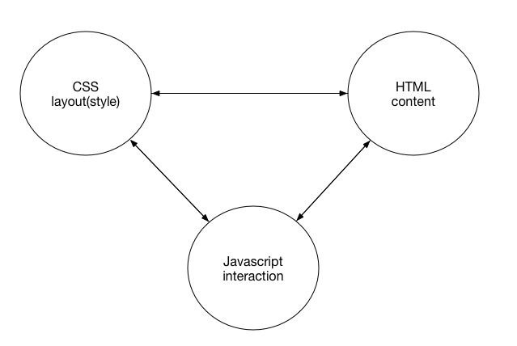
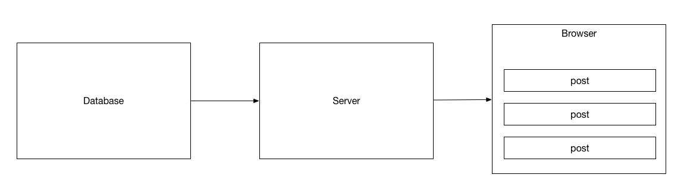
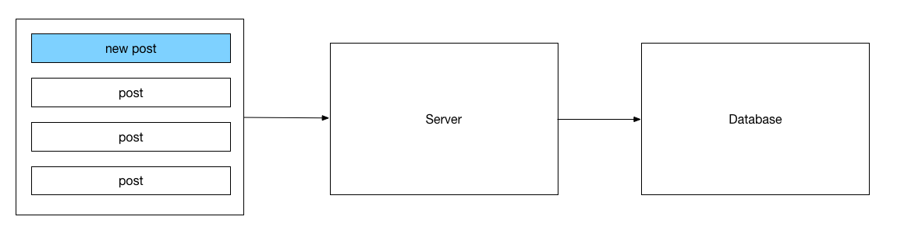
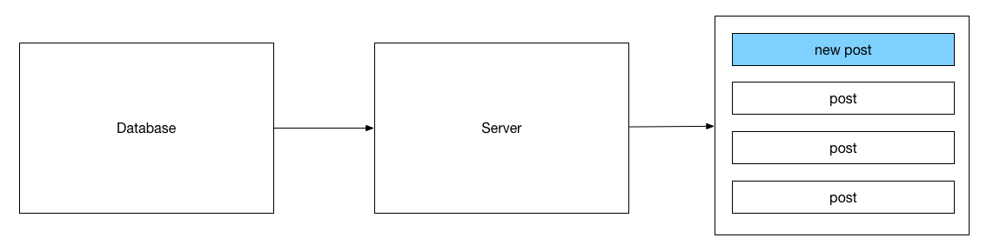

# HTML, CSS, Javascript

-----

* HTML - contents
    * Text
    * Images
    * Audio
    * Video

-----

* CSS - style
    * Position
    * Font
    * Height and width

-----

* Javascript - interaction
    * Handle events
    * Update contents and style

-----

# Frontend, Backend, Database

* Open Facebook, see the posts from friends

-----

* You make a new post

-----

* How other people will see your post

