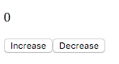
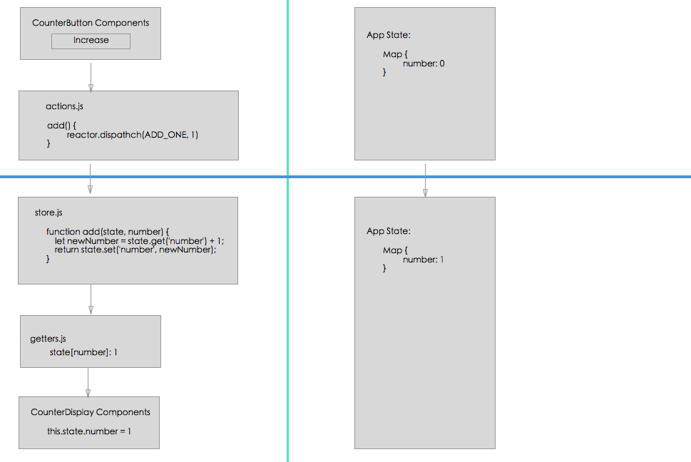
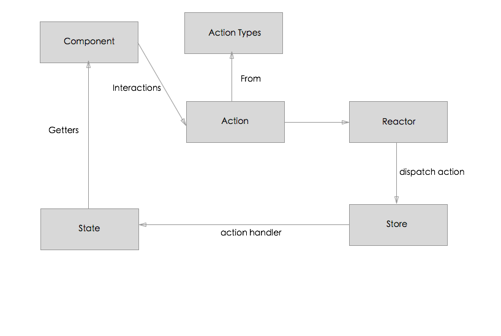

## Simple Counter App with React and Nuclear JS

For basic information about React and Nuclear.js, please see the links below:

- [React Official Website](https://facebook.github.io/react/)
- [NuclearJS Official Website](https://optimizely.github.io/nuclear-js/)
- [Tilo's Article about React and Nuclear JS](http://tilomitra.com/front-end-apps-with-nuclearjs/)

For the past three years in the road of learning frameworks and libraries for Javascript, I always prefer starting with a counter app, which is even more simpler than the popular todo list App. I've relized that it is the most efficient and fastest way to get familiar with a new thing. Compared to the traditaional todo list App, the counter app will give you the general idea of what you are trying to learn without considering the logic and the structrue of the todo list app itself. For example, taking care of the details like 'what happened if we create a new todo list?', 'what happend if we mark a list as completed', or 'what happend if we want to put a list back after it is marked as completed?' will give you some of the extra work beyond the new stuff you want to go though. So the path in my mind is counter app first, then todo list app next.

So in the tutorial I'd like to go though all the details about how to make the basic counter app with React, ES6, and Nuclear JS. The tutorial will concentrate on how to structure the app with React and Nuclear JS rather than the tools I'm using themselves. And you also should have the basic idea about React, ES6, and Nuclear JS to follow along.

Let's take a look for the counter app first.
- CounterApp
    - Display: Display the current number, default is 0
    - Buttons:
        - Increase: increase the number by 1 
        - Decrease: decrease the number by 1

Here is how the app looks like (don't waste your time on css here, just go for what you need first!):


## UI Components

There are a lot of ways to write a React App. My personal taste is starting from the real components first (UI).

- CounterDisplay.js
```js
export default React.createClass({
    // need a way to get the initial state (value) of the number
    // will be added in future steps

    render() {
        return (
            <div>
                <p>{this.state.number}</p>
            </div>
        );
    }
});
```

- CounterButtons.js
```js
export default React.createClass({
    render() {
        return (
            <div>
                <button onClick={this.add}>Increase</button>
                <button onClick={this.minus}>Decrease</button>
            </div>
        );
    },

    add() {
        // need implementation
    },

    minus() {
        // need implementation
    }
});
```

- CounterApp.js
```js
export default React.createClass({
    render() {
        return (
            <div>
                <CounterDisplay />
                <CounterIncreaseButton />
            </div>
        );
    }
});
```

Now you will see something like this when open the web page:



## Setting Up Nuclear JS Module

Let talk about how to structure the Nuclear JS App first. There is a great [aricle from Tilo](http://tilomitra.com/front-end-apps-with-nuclearjs/) talking about the detail of Nuclear App structure. Please read that first to get the general idea.

### App Overview

The App is built by a number of modules:
- Module 1
- Module 2
- Module 3
- reactor
- App.js (for running the entire App, like the main function in Java or C/C++)

In Nuclear, the Reactor is the brains of the system and in some ways analogous to the traditional Flux dispatcher, and generally you'll only have one reactor for your application.
#### reactor.js
```js
import { Reactor } from 'nuclear-js';

const reactor = new Reactor({
  debug: true
});

export default reactor;
```

### Module Overview

For each module, we should have:
- CounterModule
    - UI components
    - actionTypes
    - actions
    - stores
    - getter

<!-- And also I prefer to have a `index.js` file to help you load all the stuff in the module. For example, there is module called Counter for the conter App:
- Counter
    - component
        - CounterDisplay
        - CounterButtons
        - CounterApp
    - stores
        - counterStore
    - actionTypes
    - actions
    - getter
    - index

In `index` file, we just import all the parts we need for the `Counter` module. -->


#### actionTypes.js
In order to correctly reference actions throughout the system, we'll create an actionTypes.js file, which is simply a collection of constants.
```js
import keyMirror from 'react/lib/keyMirror';

export default keyMirror({
    ADD_ONE: null,
    MINUS_ONE: null
});
```

#### actions.js
Actions are functions that you call to send data into the system. In Nuclear, any function that calls reactor.dispatch(actionType: string, payload: any) is categorized as an action.
```js
import reactor from '../reactor';
import { ADD_ONE, MINUS_ONE} from './actionTypes';

export default {
    add() {
        reactor.dispatch(ADD_ONE, 1); // increase by 1, payload here is 1
    },

    minus() {
        reactor.dispatch(MINUS_ONE, 1) // decress by 1, pay load here is 1
    }
};
```
#### Store
In Flux, stores are used for managing application state, but they don't represent a single record of data like resource models do.

More than simply managing ORM-style objects, stores manage the state for a particular domain within the application.

Unlike many other Flux libraries, NuclearJS stores hold no state. Instead, they provide a collection of functions that transform current state into new state.

Stores provide a getInitialState method, which returns the initial state value that a store will manage, and an initialize hook, which is used to define what actions a store will respond to by attaching handlers.

Each attached handler takes in current state, transforms it according to the action and its payload, then returns new state. Handlers have the following signature:
```js
handler(currentState: any, payload: any)
```
In Nuclear, state can only be an ImmutableJS data type, such as an Immutable.Map or an Immutable.List, or a JavaScript primitive.
```js
import { Store, toImmutable } from 'nuclear-js'
import { ADD_ONE , MINUS_ONE} from './actionTypes'

export default Store({
    getInitialState() {
        return toImmutable({number: 0});
    },

    initialize() {
        this.on(ADD_ONE, add);
        this.on(MINUS_ONE, minus);
    }
});

function add(state, number) {
    let newNumber = state.get('number') + 1;
    return state.set('number', newNumber);
}

function minus(state, number) {
    let newNumber = state.get('number') - 1;
    return state.set('number', newNumber);
}
```

After creating the store, you have to do the registering of the store to:
- Passes every dispatched action to the store
- Binds the state the store manages to the application state by the key used for registration
```js
import reactor from '../reactor';
import NumberStore from './store';

reactor.registerStores({
  'number': NumberStore
});
```
#### Module Loader

Let's take a look for the module structure again:
- CounterModule
    - UI components
    - actionTypes
    - actions
    - stores
    - getter
- Another Module
- reactor
- App.js (for running the entire App, like the main function in Java or C/C++)


I'd like to talk my way to export/load every module in the App. Below is the how to export the `CounterModule` and how to load it in `App.js`:
- Add an `index.js` under `CounterModule`:
```js
import reactor from '../reactor';
import NumberStore from './store';
import CounterApp from './components/CounterApp';

reactor.registerStores({
  'number': NumberStore
});

export default CounterApp;
```
- In `App.js`:
```js
import React from 'react';
import CounterApp from './Counter';

React.render(<CounterApp/>, document.getElementById('react')); 
```
#### Now it's time to complete the `CounterButtons` components
```js
import React from 'react';
import actions from '../actions'

export default React.createClass({
    render() {
        return (
            <div>
                <button onClick={this.add}>Increase</button>
                <button onClick={this.minus}>Decrease</button>
            </div>
        );
    },

    add() {
        actions.add();
    },

    minus() {
        actions.minus();
    }
});
```
## Getters
Let's take another look at what we have for `CounterDisplay` component:

```js
export default React.createClass({
    // need a way to get the initial state (value) of the number
    // will be added in future steps

    render() {
        return (
            <div>
                <p>{this.state.number}</p>
            </div>
        );
    }
});
```

In the traditional React we will use `getInitailState()` to initialize the state of a component:

```js
getInitialState: function() {
	return {number: 0};
}
```

In Nuclear JS, we are going to use `Getter` to get the corresponding state from the entire App's state:
- getters.js

```js
const number = ['number'];

export default { number };
```
- CounterDisplay.js

```js
import React from 'react';
import reactor from '../../reactor';
import getters from '../getters';

export default React.createClass({
    mixins: [reactor.ReactMixin],

    getDataBindings() {
        return {
            number: getters.number
        }
    },

    render() {
        return (
            <div>
                <p>{this.state.number}</p>
            </div>
        );
    }
});
```
It is the most confusing part when I was trying to learn Nuclear JS. Don't worry for now. You can have a better understanding for his with the following section.

## A Walkthrough Example
Let's take a look for what will happen when we click the `increase` button in the UI:

- At the very begining, the `getInitialState()` in `store.js` will be called when registering Stores. The App state will be set to:

```
Map {
	number: 0
}
```

- After clicking the `increase` button, the `add(ADD_ONE, 1)` fucntion in `actions.js` will be called to let `reactor` dispatch the `ADD_ONE` action with payload `1`.
- The handler function `add(state, 1)` in `store` will be called to update the state to:

```
Map {
	number: 1
}
```
- When the state of `number` changes, the state for the `CounterDisplay` changes. `this.state.number` in `CounterDisplay` will be updated via `getter`

## Data Flow
Here is the Data Flow of the counter app:


## Source Code
[Click here to view all the code on github](https://github.com/haochuan/react-start/tree/counterAPP)

Also you can find the [gulp setting](https://github.com/haochuan/react-start/blob/counterAPP/gulpfile.js) I'm using for React and ES6.
